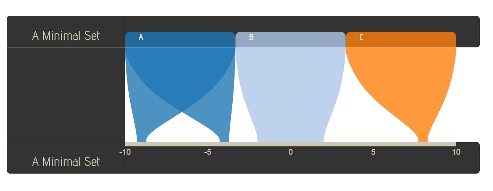
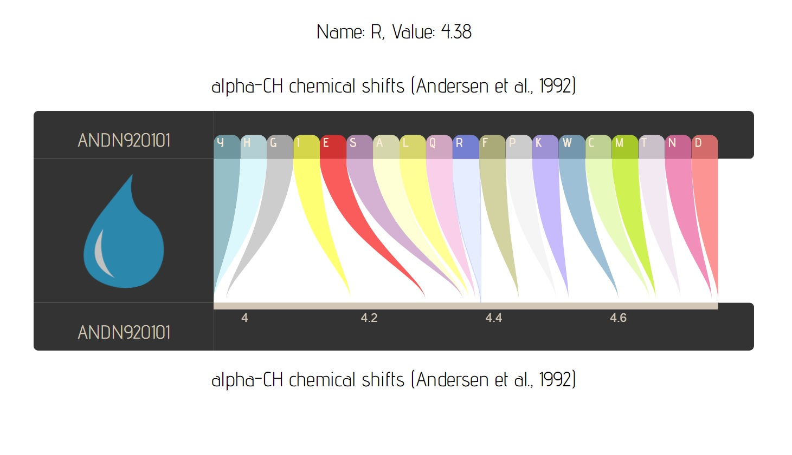
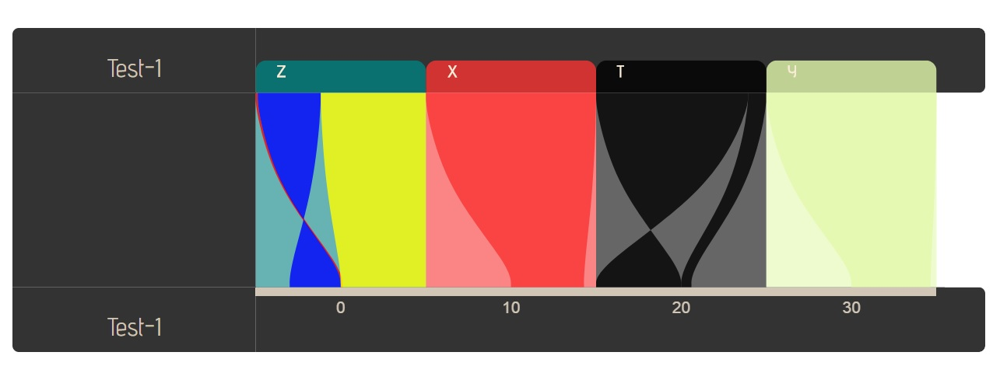
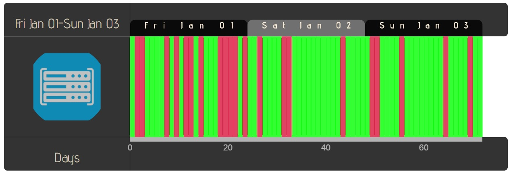
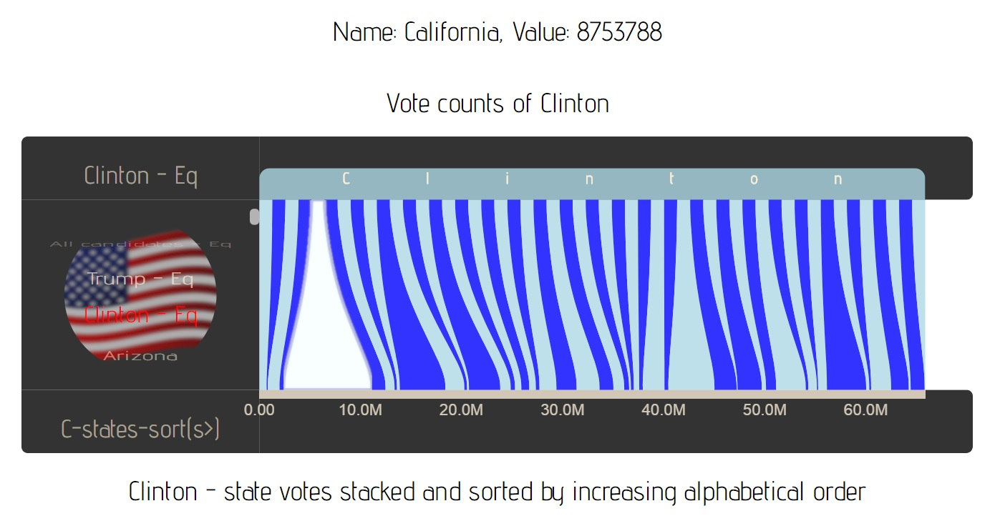
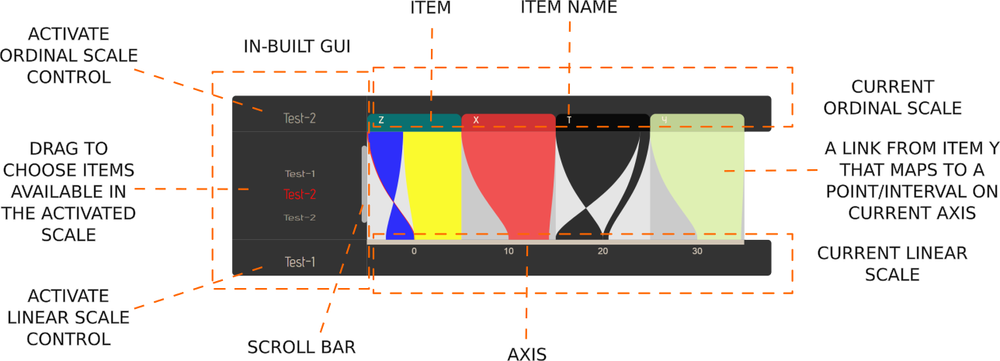

# <a id="h1" href="#h1">Lexicon-Rainbow [:rainbow:](MAIN)</a>

[](https://travis-ci.org/IbrahimTanyalcin/lexicon-rainbow)

<br>

<hr>

* [API](#api)
* [UMD](#umd)
* [Examples](#minimal-example)
* [Guidelines](#guidelines)
* [What is it ?](#what-is-it-)
* [Which browsers ?](#which-browsers-)
* [Which version of Javascript](#which-version-of-javascript-)
* [Which dependencies ?](#which-dependencies-)
* [Usage](#usage)
* [Installation](#installation)
* [How do I use it ?](#how-do-i-use-it-)
* [Support](#support)

<hr>

<br>

>## Minimal example:
>[][MAIN] 

>## Comparing 2 tables:
>[][MAIN]

>## Some random data:
>[][MAIN] 

>## Server down time report:
>[][MAIN] 

>## 2016 US elections:
>[][MAIN] 

<br>

## Guidelines

### Legends

Below table describes the techinal jargon used for this repository.

Phrase | Definition
-------|-----------
:link: |link to related doc, if not then *this*
:mag:  |link to script
xyz.(a)|single argument *a*
xyz.(a[,b[,c]])|optinal arguments *b* and *c*
{x} | a variable *y* with typeof *y* === "x"

### Repository folder structure

<pre>
root
|-- dev
|	|-- lexiconRainbow.d3v3.dev.js
|	`-- lexiconRainbow.d3v4.dev.js
|-- min
|   |-- lexiconRainbow.d3v3.min.js  
|	`-- lexiconRainbow.d3v4.min.js  
|-- pretty
|   |-- lexiconRainbow.d3v3.pretty.js 
|   `-- lexiconRainbow.d3v4.pretty.js 
|-- examples
|   |-- AminoAcids
|   |   |-- AAColorScheme.png
|   |   |-- aminoAcids.png
|   |   |-- droplet.png
|   |   |-- index_v3.html
|   |   |-- index_v4.html
|   |   `-- loadData.js
|   |-- Minimal
|	|	|-- index_v3.html
|	|	|-- index_v4.html
|	|	`-- minimal.jpg
|   |-- RandomDataset
|	|	|-- index_v3.html
|	|	|-- index_v4.html
|	|	|-- droplet.png
|	|	`-- randomDataset.jpg
|   |-- ServerDownTime
|	|	|-- index_v3.html
|	|	|-- index_v4.html
|	|	|-- server.png
|	|	`-- serverDownTime.jpg
|   `-- USvotes
|		|-- index_v3.html
|		|-- index_v4.html
|		|-- server.png
|		`-- serverDownTime.jpg
|-- img
|	`-- anatomy.png
|-- tests
|	|-- index_v3.html
|	|-- index_v4.html
|	|-- phantomjsTest.js <sub>(Render ./index.*\.html and print base64 data uri)</sub>
|	`-- nodejsTest.js <sub>(Test with node and log enumerabl properties)</sub>
|-- .gitignore <sub>(Ignore .\private\*)</sub>
|-- .travis.yml <sub>(For testing with PhantomJS)</sub> <a href="./.travis.yml">🔗</a>(./.travis.yml)
|-- CODE_OF_CONDUCT.md
|-- LICENSE
`-- README.md 
</pre>

<br>

## Anatomy 
Below is an summary of different parts of the visualization.



<br>

## What is it ?
[Lexicon-rainbow](#h1) is a library for visualizing combination of an ordinal scale (top) and a linear scale (bottom). Suppose you have items sorted based on some criteria at the top. From each item, you can define a link (ribbon, arm or whatever name you fancy) that goes to the linear scale. This link can be an integer, float or a range. You can specify as many ordinal and linear scales as you like. Then you either use the inbuit GUI or programmatic access (```lexiconRainbow.ordinalG.update({number})```) to create new *views* of your data.

<br>

## Which browsers ? 
Lexicon-rainbow is tested with ie11, safari, chrome and firefox. It should also work on ie10, however svg related bugs maybe present under ie10. If you find one, please report them.

<br>

## Which version of Javascript ? 
It is written in ES5. You do __NOT__ need Babel and Browserify.

<br>

## Which dependencies ? 
There are 2 versions of lexicon-rainbow, one compatible with d3.v3 **(3.5.17)** and the other with d3.v4 (**latest**).

<br>

## Usage 
Drop one of the script tags below in your html file.

<table>
	<tr>
		<td></td>
		<td><b>Your version of d3</b></td>
		<td><b>Script tag to use</b></td>
	</tr>
	<tr>
		<td rowspan="2"><b>Development version</b></td>
		<td>d3v3</td>
		<td>
			<code>
				<sub>&lt;script src="//ibrahimtanyalcin.com/lexiconRainbow.d3v3.dev.js"&gt;&lt;/script&gt;</sub>
			</code>
		</td>
	</tr>
	<tr>
		<td>d3v4</td>
		<td>
			<code>
				<sub>&lt;script src="//ibrahimtanyalcin.com/lexiconRainbow.d3v4.dev.js"&gt;&lt;/script&gt;</sub>
			</code>
		</td>
	</tr>
	<tr>
		<td rowspan="2"><b>Pretty version</b></td>
		<td>d3v3</td>
		<td>
			<code>
				<sub>&lt;script src="//ibrahimtanyalcin.com/lexiconRainbow.d3v3.pretty.js"&gt;&lt;/script&gt;</sub>
			</code>
		</td>
	</tr>
	<tr>
		<td>d3v4</td>
		<td>
			<code>
				<sub>&lt;script src="//ibrahimtanyalcin.com/lexiconRainbow.d3v4.pretty.js"&gt;&lt;/script&gt;</sub>
			</code>
		</td>
	</tr>
	<tr>
		<td rowspan="2"><b>Minified version</b></td>
		<td>d3v3</td>
		<td>
			<code>
				<sub>&lt;script src="//ibrahimtanyalcin.com/lexiconRainbow.d3v3.min.js"&gt;&lt;/script&gt;</sub>
			</code>
		</td>
	</tr>
	<tr>
		<td>d3v4</td>
		<td>
			<code>
				<sub>&lt;script src="//ibrahimtanyalcin.com/lexiconRainbow.d3v3.min.js"&gt;&lt;/script&gt;</sub>
			</code>
		</td>
	</tr>
</table>

## Installation

## Testing

## API

[MAIN]: https://github.com/IbrahimTanyalcin/LEXICON