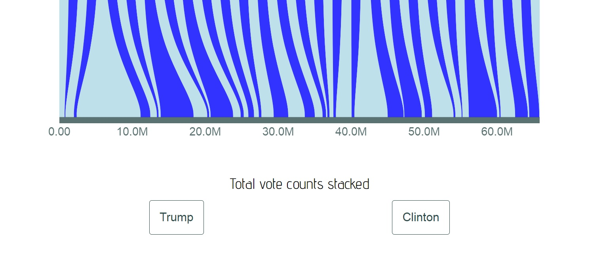

# <a id="h1" href="#h1">Lexicon-Rainbow [:rainbow:](https://github.com/IbrahimTanyalcin/LEXICON)</a>

[](https://travis-ci.org/IbrahimTanyalcin/lexicon-rainbow) 
[](https://gitter.im/lexicon-rainbow)
[](https://badge.fury.io/js/lexicon-rainbow)
[](https://www.codacy.com/app/IbrahimTanyalcin/lexicon-rainbow?utm_source=github.com&amp;utm_medium=referral&amp;utm_content=IbrahimTanyalcin/lexicon-rainbow&amp;utm_campaign=Badge_Grade)
<a href="https://www.patreon.com/ibrahimTanyalcin" title="Patreon donate"></a>

<br>

<hr>

* [How do I use it ?](#how-do-i-use-it-)
* [NPM](#npm)
* [API](#api)
* [UMD](#umd)
* [Examples](#minimal-example)
* [Guidelines](#guidelines)
* [What is it ?](#what-is-it-)
* [Which browsers ?](#which-browsers-)
* [Which version of Javascript](#which-version-of-javascript-)
* [Which dependencies ?](#which-dependencies-)
* [Usage](#usage)
* [Installation](#installation)
* [Youtube](#youtube)
* [Known Issues](#known-issues)
* [Acknowledgement](#acknowledgement)
* [Support](#support)


<hr>

<br>

>## [One Model, Many Views][PROTEIN]:
>[][PROTEIN] 

>## [Minimal example][MINIMAL]:
>[][MINIMAL] 

>## [Comparing 2 tables][AMINOACIDS]:
>[][AMINOACIDS]

>## [Some random data][RANDOMDATA]:
>[][RANDOMDATA] 

>## [Server down time report][SERVER]:
>[][SERVER] 

>## [2016 US elections][VOTES]:
>[][VOTES] 

>## [Programmatic Access][PROGRAMMATIC]:
>[][PROGRAMMATIC] 

<br>

## NPM
If you are reading this document from NPM, relative links and images might not work, instead refer to the
<a href="https://github.com/IbrahimTanyalcin/lexicon-rainbow" title="Github Readme"><b>GITHUB README</b></a>.

## Guidelines

### Legends

Below table describes the techinal jargon used for this repository.

Phrase | Definition
-------|-----------
:link: |link to related doc, if not then *this*
:mag:  |link to script
xyz.(a)|single argument *a*
xyz.(a[,b[,c]]) {a'\|a'',b',c'}|optional arguments *b* and *c* with argument a having variable type(s) a' or a'',b having b' and c having c'.*
{x} | a variable *y* with typeof *y* === "x"
lexiconRainbow | lexicon-rainbow **instance**
LexiconRainbow | lexicon-rainbow **constructor**

<sub>*: Possible variable types: "number", "string", "function", "boolean".
For clear distinction '{}' represents object literal while '[]' represents an array literal.<sub/>

### Repository folder structure

As a developer, you are probably more interested in just getting the script and dropping in your html file. 
So the ones you should care about are marked with :white_check_mark:

<pre>
root
|-- dev
|   |-- lexiconRainbow.d3v3.dev.js <sub>(development version of the library for d3 v3)</sub> <a href="../dev/lexiconRainbow.d3v3.dev.js">🔍</a> &#10004;
|   `-- lexiconRainbow.d3v4.dev.js <sub>(development version of the library for d3 v4)</sub> <a href="../dev/lexiconRainbow.d3v4.dev.js">🔍</a> &#10004;
|-- min
|   |-- lexiconRainbow.d3v3.min.js <sub>(minified version of the library for d3 v3)</sub> <a href="../min/lexiconRainbow.d3v3.min.js">🔍</a> &#10004;
|   `-- lexiconRainbow.d3v4.min.js <sub>(minified version of the library for d3 v4)</sub> <a href="../min/lexiconRainbow.d3v4.min.js">🔍</a> &#10004;
|-- pretty
|   |-- lexiconRainbow.d3v3.pretty.js <sub>(beautified version of the library for d3 v3)</sub> <a href="../pretty/lexiconRainbow.d3v3.pretty.js">🔍</a> &#10004;
|   `-- lexiconRainbow.d3v4.pretty.js <sub>(beautified version of the library for d3 v4)</sub> <a href="../pretty/lexiconRainbow.d3v4.pretty.js">🔍</a> &#10004;
|-- examples
|   |-- AminoAcids
|   |   |-- AAColorScheme.png <sub>(Glyph)</sub> <a href="../examples/AminoAcids/AAColorScheme.png">🔍</a>
|   |   |-- aminoAcids.jpg <sub>(Output of the example)</sub> <a href="../examples/AminoAcids/aminoAcids.jpg">🔍</a>
|   |   |-- droplet.png <sub>(Glyph)</sub> <a href="../examples/AminoAcids/droplet.png">🔍</a>
|   |   |-- index_v3.html <sub>(d3 v4 example)</sub> <a href="../examples/AminoAcids/index_v3.html">🔍</a>
|   |   |-- index_v4.html <sub>(d3 v4 example)</sub> <a href="../examples/AminoAcids/index_v4.html">🔍</a>
|   |   `-- loadData.js <sub>(Load data via script tag)</sub> <a href="../examples/AminoAcids/loadData.js">🔍</a>
|   |-- Minimal
|   |   |-- index_v3.html <sub>(d3 v3 example)</sub> <a href="../examples/Minimal/index_v3.html">🔍</a>
|   |   |-- index_v4.html <sub>(d3 v4 example)</sub> <a href="../examples/Minimal/index_v4.html">🔍</a>
|   |   `-- minimal.jpg <sub>(Output of the example)</sub> <a href="../examples/Minimal/minimal.jpg">🔍</a>
|   |-- RandomDataset
|   |   |-- index_v3.html <sub>(d3 v3 example)</sub> <a href="../examples/RandomDataset/index_v3.html">🔍</a>
|   |   |-- index_v4.html <sub>(d3 v4 example)</sub> <a href="../examples/RandomDataset/index_v4.html">🔍</a>
|   |   |-- droplet.png <sub>(Glyph)</sub> <a href="../examples/RandomDataset/droplet.png">🔍</a>
|   |   `-- randomDataset.jpg <sub>(Output of the example)</sub> <a href="../examples/RandomDataset/randomDataset.jpg">🔍</a>
|   |-- ServerDownTime
|   |   |-- index_v3.html <sub>(d3 v3 example)</sub> <a href="../examples/ServerDownTime/index_v3.html">🔍</a>
|   |   |-- index_v4.html <sub>(d3 v4 example)</sub> <a href="../examples/ServerDownTime/index_v4.html">🔍</a>
|   |   |-- server.png <sub>(Glyph)</sub> <a href="../examples/ServerDownTime/server.png">🔍</a>
|   |   `-- serverDownTime.jpg <sub>(Output of the example)</sub> <a href="../examples/ServerDownTime/serverDownTime.jpg">🔍</a>
|   |-- USvotes
|   |   |-- index_v3.html <sub>(d3 v3 example)</sub> <a href="../examples/USvotes/index_v3.html">🔍</a>
|   |   |-- index_v4.html <sub>(d3 v4 example)</sub> <a href="../examples/USvotes/index_v4.html">🔍</a>
|   |   |-- loadData.js <sub>(Load data via script tag)</sub> <a href="../examples/USvotes/loadData.js">🔍</a>
|   |   |-- usFlag.png <sub>(Glyph)</sub> <a href="../examples/USvotes/usFlag.png">🔍</a>
|   |   `-- USvotes.jpg <sub>(Output of the example)</sub> <a href="../examples/USvotes/USvotes.jpg">🔍</a>
|   |-- USvotes_programmatic
|   |   |-- index_v3.html <sub>(d3 v3 example)</sub> <a href="../examples/USvotes_programmatic/index_v3.html">🔍</a>
|   |   |-- index_v4.html <sub>(d3 v4 example)</sub> <a href="../examples/USvotes_programmatic/index_v4.html">🔍</a>
|   |   |-- loadData.js <sub>(Load data via script tag)</sub> <a href="../examples/USvotes_programmatic/loadData.js">🔍</a>
|   |   |-- usFlag.png <sub>(Glyph)</sub> <a href="../examples/USvotes_programmatic/usFlag.png">🔍</a>
|   |    `-- USvotes_programmatic.jpg <sub>(Output of the example)</sub> <a href="../examples/USvotes_programmatic/USvotes_programmatic.jpg">🔍</a>
|   `-- Protein
|       |-- index_v3.html <sub>(d3 v3 example)</sub> <a href="../examples/Protein/index_v3.html">🔍</a>
|       |-- index_v4.html <sub>(d3 v4 example)</sub> <a href="../examples/Protein/index_v4.html">🔍</a>
|       |-- protein1.jpeg <sub>(Glyph)</sub> <a href="../examples/Protein/protein1.jpeg">🔍</a>
|       |-- protein2.jpg <sub>(Glyph)</sub> <a href="../examples/Protein/protein2.jpg">🔍</a>
|       |-- protein3.png <sub>(Glyph)</sub> <a href="../examples/Protein/protein3.png">🔍</a>
|       `-- rainbow.gif <sub>(Output of the example)</sub> <a href="../examples/Protein/rainbow.gif">🔍</a>
|-- snippets <sub>(Code samples for BioJS)</sub>
|-- img
|   `-- anatomy.png <sub>(Parts of the visualization)</sub> <a href="../img/anatomy.png">🔍</a>
|-- tests
|   |-- index_v3.html <sub>(Page for headless testing with d3 v3)</sub> <a href="../tests/index_v3.html">🔍</a>
|   |-- index_v4.html <sub>(Page for headless testing with d3 v4)</sub> <a href="../tests/index_v4.html">🔍</a>
|   |-- phantomjsTest.js <sub>(Render ../index.*\.html and print base64 data uri)</sub> <a href="../tests/phantomjsTest.js">🔍</a>
|   `-- nodejsTest.js <sub>(test for node, npm install)</sub> <a href="../tests/nodejsTest.js">🔍</a>
|-- docs
|   |-- CODE_OF_CONDUCT.md <sub>(CoC)</sub> <a href="./CODE_OF_CONDUCT.md">🔍</a>
|   |-- LICENSE <sub>(License)</sub> <a href="./LICENSE">🔍</a>
|   |-- README.md <sub>(Readme)</sub> <a href="./README.md">🔍</a> &#10004;
|   |-- API.md <sub>(Readme)</sub> <a href="./API.md">🔍</a> &#10004;
|   `-- CONTRIBUTING.md <sub>(Contribution guideline)</sub> <a href="./CONTRIBUTING.md">🔍</a>
|-- .gitignore <sub>(Ignore ./private)</sub> <a href="../.gitignore">🔍</a>
|-- package.json <sub>(Package json file for npm)</sub> <a href="../package.json">🔍</a>
|-- .travis.yml <sub>(For testing with PhantomJS)</sub> <a href="../.travis.yml">🔍</a>
|-- .eslintrc.json <sub>(Custom linting rules :trollface:)</sub> <a href="../.eslintrc.json">🔍</a>
`-- .jsbeautifyrc.json <sub>(Rules for jsbeautify)</sub> <a href="../.jsbeautifyrc.json">🔍</a>


</pre>

<br>

## Anatomy 
Below is an summary of different parts of the visualization.


<br>

## What is it ?
[Lexicon-rainbow](#h1) is a library for visualizing combination of an ordinal scale (top) and a linear scale (bottom). Suppose you have items sorted based on some criteria at the top. From each item, you can define a link (ribbon, arm or whatever name you fancy) that goes to the linear scale. This link can be an integer, float or a range. You can specify as many ordinal and linear scales as you like. Then you either use the inbuit GUI or programmatic access (```lexiconRainbow.ordinalG.update({number})```) to create new *views* of your data.

<br>

## Which browsers ? 
Lexicon-rainbow is tested with ie11, safari, chrome and firefox. It should also work on ie10, however svg related bugs maybe present under ie10. If you find one, please report them.

<br>

## Which version of Javascript ? 
It is written in ES5. You do __NOT__ need Babel and Browserify.

<br>

## Which dependencies ? 
There are 2 versions of lexicon-rainbow, one compatible with d3.v3 **(3.5.17)** and the other with d3.v4 (**latest**).

<br>

## How do I use it ? 
Refer to [Usage](#usage) and [API Reference](#api)

<br>

## Usage 
Drop one of the script tags below in your html file.

<table>
	<tr>
		<td></td>
		<td><b>Your version of d3</b></td>
		<td><b>Script tag to use</b></td>
	</tr>
	<tr>
		<td rowspan="2"><b>Development version</b></td>
		<td>d3v3</td>
		<td>
			<code>
				<sub>&lt;script src="//cdn.rawgit.com/IbrahimTanyalcin/lexicon-rainbow/5a8fc102/dev/lexiconRainbow.d3v3.dev.js"&gt;&lt;/script&gt;</sub>
				<br>
				<sub>&lt;script src="//ibrahimtanyalcin.com/lexiconRainbow.d3v3.dev.js"&gt;&lt;/script&gt;</sub>
			</code>
		</td>
	</tr>
	<tr>
		<td>d3v4</td>
		<td>
			<code>
				<sub>&lt;script src="//cdn.rawgit.com/IbrahimTanyalcin/lexicon-rainbow/5a8fc102/dev/lexiconRainbow.d3v4.dev.js"&gt;&lt;/script&gt;</sub>
				<br>
				<sub>&lt;script src="//ibrahimtanyalcin.com/lexiconRainbow.d3v4.dev.js"&gt;&lt;/script&gt;</sub>
			</code>
		</td>
	</tr>
	<tr>
		<td rowspan="2"><b>Pretty version</b></td>
		<td>d3v3</td>
		<td>
			<code>
				<sub>&lt;script src="//cdn.rawgit.com/IbrahimTanyalcin/lexicon-rainbow/5a8fc102/pretty/lexiconRainbow.d3v3.pretty.js"&gt;&lt;/script&gt;</sub>
				<br>
				<sub>&lt;script src="//ibrahimtanyalcin.com/lexiconRainbow.d3v3.pretty.js"&gt;&lt;/script&gt;</sub>
			</code>
		</td>
	</tr>
	<tr>
		<td>d3v4</td>
		<td>
			<code>
				<sub>&lt;script src="//cdn.rawgit.com/IbrahimTanyalcin/lexicon-rainbow/5a8fc102/pretty/lexiconRainbow.d3v4.pretty.js"&gt;&lt;/script&gt;</sub>
				<br>
				<sub>&lt;script src="//ibrahimtanyalcin.com/lexiconRainbow.d3v4.pretty.js"&gt;&lt;/script&gt;</sub>
			</code>
		</td>
	</tr>
	<tr>
		<td rowspan="2"><b>Minified version</b></td>
		<td>d3v3</td>
		<td>
			<code>
				<sub>&lt;script src="//cdn.rawgit.com/IbrahimTanyalcin/lexicon-rainbow/5a8fc102/min/lexiconRainbow.d3v3.min.js"&gt;&lt;/script&gt;</sub>
				<br>
				<sub>&lt;script src="//ibrahimtanyalcin.com/lexiconRainbow.d3v3.min.js"&gt;&lt;/script&gt;</sub>
			</code>
		</td>
	</tr>
	<tr>
		<td>d3v4</td>
		<td>
			<code>
				<sub>&lt;script src="//cdn.rawgit.com/IbrahimTanyalcin/lexicon-rainbow/5a8fc102/min/lexiconRainbow.d3v4.min.js"&gt;&lt;/script&gt;</sub>
				<br>
				<sub>&lt;script src="//ibrahimtanyalcin.com/lexiconRainbow.d3v4.min.js"&gt;&lt;/script&gt;</sub>
			</code>
		</td>
	</tr>
</table>

<br>

:warning: WARNING: The rawgit cache expires every 24 hours. In case there is a new version pushed to master branch, you might need to wait until
the cache expires. Alternatively you can use ibrahimtanyalcin.com which will be active in a week (waiting for SSL). The cache expiration time on 
ibrahimtanyalcin.com will be 10 minutes.

## Installation
```shell
$ npm install lexicon-rainbow
```

:warning: WARNING: The install assumes that you will be using d3 version 4 by default. If not, you have to remove the default d3, install d3 version ^3.5.17
and use one of the d3 version 3 compatible scripts within dev/ pretty/ or min/ folders.

<br>

## Testing
Once you install the module you can call from the **root** of your project:

```shell
$ node node_modules/lexicon-rainbow/tests/nodejsTest.js
```

or you can move to the directory of the lexicon rainbow and call:

```shell
$ npm run test
```
OR
```shell
$ npm test
```


The test file ```requires``` module and prints out all enumerable properties of the exported object.
This library is not for use on server side (because you cannot manipulate the DOM). 
The test file is just there to control if the object can be exported.
To use this library with other libraries on the server side to be later used for client consumption you shoulduse a tool like Browserify.

<br>

## API
For a detailed list of available methods, refer to [API.md](./API.md).

The general pattern for invoking lexicon-rainbow is as follows:

```js
(new LexiconRainbow) //initiate a new instance

.container("#containerDiv") //pass a node or id

.forceStyle() //take advantage of embedded style

.w(600) //set width of the viewbox

.h(200) //set height of the viewbox

.sW("1000px") //set css style width of the viewport

.sH("auto") //set css style height of the viewport

.position("relative") //set css style position

.sTop("0px") //set css style top property of the viewport

.sLeft("0px") //set css style left property of the viewport

.sMargin("100px auto 0px auto") //set css style margin property of the viewport

.lexID("lexiconRainbow") //set an id for the generated SVG

.input(sample) //provide the data

.append(true) //initialize internal variables

.render(); //render scene
```

>Note:
>_Viewport means the space taken up by the ```ownerSVGElement``` in document coordinates. Think of it as the values returned by ```SVGElement.getBoundingClientRect()```.
>(Space excluding the SVG's border) The Viewbox on the other hand is the user defined coordinate system in units of **userSpaceOnUse**_

<br>

## UMD
The library is wrapped inside UMD. You should be able to use it with CommonJS or AMD. In browser environment you will have ```LexiconRainbow``` **constructor** as global variable.

<br>

## Youtube
Static figures only gives an idea. You can go to my [youtube channel](https://www.youtube.com/channel/UCmtQOhFPZ7FH_jVwtv4-GFw) and start from [this](about:blank) video to have a better overview. 

<br>

## Known Issues
* When there are too many links coming out from one item, you might have flicker issues,
as the event.target/elementFromPoint does not point to the right element. For the time being
consider turning off [`enableOnpick`](./API.md#enableonpick-link).
* In lexicon-rainbow d3v3 version, if your data object has the "axis" field set, the **tick path**
won't get colored due to [stroke style](../dev/lexiconRainbow.d3v3.dev.js#L139) not set. 
This will be fixed in the next patch. 

<br>

## Acknowledgement
* People
  * [Tuncer Can](https://www.linkedin.com/in/tuncercan/) for server side maintanance and file hosting
  * [Mike Bostock](https://d3js.org/) for D3.
* Projects
  * The Mutaframe ([][MUTAFRAME]) project, started in 2016 aims to be a visualization platform for mutations in human proteome (single nucleotide variants on coding regions of the human genome)
  that is guided by machine learning. What was unique about the project is that, it's not just about visualization of any data, it is related to healthcare. Several tools that is developed during this project (including this one) can also be used for generic purpose.
  I will document and release these tools as I sieze the opportunity.
* Organizations
  * [](http://ibsquare.be/) for a fruitfull project that lead to development of [Mutaframe][MUTAFRAME] and many other micro libraries.
  * [](https://europa.eu/european-union/index_en) for coordinating funds for the [Mutaframe][MUTAFRAME] project which eventually lead to development
  of many small libraries including this one.
  * [](http://www.innoviris.be/en?set_language=en) for funding the [Mutaframe][MUTAFRAME] project.

## Support
I work on several small to medium sized projects. Development in one can also lead to development of the others. So if you would like to show your
support for this project you can contribute to my [PATREON](https://www.patreon.com/ibrahimTanyalcin) page.

<br>


[MINIMAL]: http://bl.ocks.org/ibrahimtanyalcin/6e2e775cb954ecf89e6b379b5fa4c510
[AMINOACIDS]: http://bl.ocks.org/ibrahimtanyalcin/3ec054bc6dc485c46631c5ef1d28dbe9
[RANDOMDATA]: http://bl.ocks.org/ibrahimtanyalcin/35d404d513420d84570eb0a418c87856
[SERVER]: http://bl.ocks.org/ibrahimtanyalcin/2e478e178470c385656a90d3a4629220
[VOTES]: http://bl.ocks.org/ibrahimtanyalcin/f0bf54f88c6859c985ee98bc5e56ae6f
[MUTAFRAME]: http://deogen2.mutaframe.com/
[PROGRAMMATIC]: http://bl.ocks.org/ibrahimtanyalcin/f2067bef081d84b85e3fb077f3272a90
[PROTEIN]:http://bl.ocks.org/ibrahimtanyalcin/37c3e06f97cda2881acbfcbb4d77e3ab
